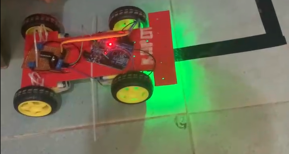

# Line-Follower-Robot
Line Follower Robot using Arduino Uno R3 
## 🚀 Video Demo

## connection
module l298 => arduino pin :
ENA => 11 ,
IN1 => 10 ,
IN2 => 9  ,

ENB => 6  ,
IN3 => 7  ,
IN4 => 8  ,

SENSOR from left to right :

SS1 => 5 ,
SS2 => 4 ,
SS3 => 3 ,
SS4 => 2 .

